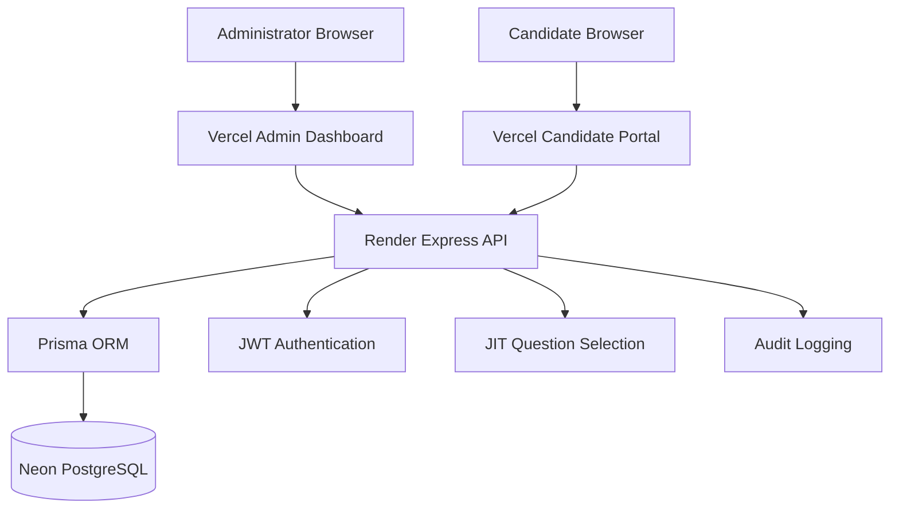

# Secure Cloud-Based Just-in-Time Question Paper Generation and Management System

## 1. Overview
This project is an academic prototype developed to address one of the most critical vulnerabilities in examination management: the premature leakage of question papers. By re-architecting how a question paper is assembled and delivered, this system significantly enhances the integrity of competitive assessments using modern web technologies.

## 2. Problem Statement
**Traditional approach:**
The complete question paper is assembled, reviewed, and stored before the examination date.

**Security problem:**
That stored complete paper becomes a high-value target for unauthorized access and leakage. Whether through compromised accounts, database extraction, or insider threats, the existence of a completed document prior to the exam creates a severe vulnerability.

## 3. Proposed Solution
**Our approach:**
1. Individual questions are stored securely in a fragmented Question Bank.
2. An examination blueprint defines the required paper structure (e.g., number of easy/medium/hard questions).
3. At the scheduled examination time, the system randomly selects appropriate questions and dynamically generates the paper.

The complete final question paper does not persist in the database prior to the examination. This is the main innovation of the system.

## 4. Objectives
- Eliminate the pre-exam storage of final question papers.
- Provide a secure repository for atomic examination questions.
- Dynamically enforce academic standards through Exam Blueprints.
- Ensure strict time-bound access for examination centers.
- Provide a clear, append-only audit trail of system events.

## 5. Core Features
- **Just-in-Time (JIT) Generation:** The core engine that randomly assembles questions at the time of the exam request.
- **Role-Based Portals:** Separate frontend interfaces for Administrators and Examination Centers.
- **Time-Bound Enforcement:** The paper generation endpoint explicitly locks when the exam window expires.
- **Audit Logging:** Database tracking of logins, exam creation, and paper retrieval.

## 6. Live Production System
The project is currently deployed and live at the following URLs:

- **Admin Dashboard (Vercel):** https://secure-question-paper-system-admin.vercel.app
- **Candidate Portal (Vercel):** https://secure-question-paper-system-candid.vercel.app
- **Backend API (Render):** https://secure-question-paper-backend-8zvm.onrender.com
- **Database:** Neon PostgreSQL

*(Note: The frontends communicate exclusively with the Render API, which in turn queries the Neon database. The frontends never connect directly to the database.)*

## 7. System Architecture


## 8. JIT Generation Architecture
The JIT (Just-in-Time) generation algorithm is the core academic contribution of this system.

1. **Exam Configuration:** An Administrator creates an Exam and assigns a Blueprint (e.g., specifying difficulty distribution).
2. **Question Bank:** Questions are added and flagged as `APPROVED`.
3. **Trigger:** A Candidate/Center logs into the portal and requests the paper (`GET /:id/paper`).
4. **Validation:** The API verifies the exam is `ACTIVE` and the request falls within the 4-hour time boundary.
5. **Question Filtering:** The system queries the database for all `APPROVED` questions.
6. **Selection:** Questions are grouped by difficulty. The algorithm randomly samples the precise number of questions required by the Blueprint using Lodash (`_.sampleSize`).
7. **Delivery:** The selected questions are stripped of their correct answers, shuffled, and returned directly in the HTTP JSON response.
8. **Persistence Mechanism:** The generated question paper exists in the backend memory temporarily and in the browser memory of the candidate. **The assembled paper is not persisted to the database.**
9. **Audit Event:** The generation is recorded in the `AuditLog`.

*(Note: Randomization relies on the standard `Math.random()` through Lodash, rather than a Cryptographically Secure Pseudo-Random Number Generator (CSPRNG).)*

## 9. System Workflow
### Admin Flow
Administrator → Vercel Admin Dashboard → Render API → Authentication/RBAC → Prisma → Neon PostgreSQL → Response

### Candidate Flow
Candidate → Vercel Candidate Portal → Render API → Token Validation → JIT Question Selection → Prisma → Neon PostgreSQL → Response

## 10. Security Architecture
The system implements the following verified security mechanisms:
- **JWT Authentication:** Cryptographically signed tokens handle stateless authentication.
- **Token Binding:** Candidate tokens are strictly bound to their requested `examId` to prevent cross-exam unauthorized access (IDOR prevention).
- **Password Hashing:** `bcrypt` ensures passwords are never stored in plaintext.
- **RBAC (Role-Based Access Control):** API endpoints enforce `ADMIN` or `CANDIDATE` roles.
- **Time Boundary Enforcement:** Exam endpoints reject requests mathematically beyond 4 hours of the scheduled time.
- **Audit Logging:** System actions (logins, JIT generation) are recorded in an append-only `AuditLog` table.
- **HTTPS:** Enforced automatically by Vercel and Render in production.
- **Parameterization:** Prisma ORM automatically prevents SQL Injection.

## 11. Technology Stack
- **Frontends:** React, Next.js, Tailwind CSS
- **Backend:** Node.js, Express.js, TypeScript
- **Database:** PostgreSQL
- **ORM:** Prisma ORM

## 12. Database Architecture
The system uses a PostgreSQL schema synchronized via Prisma.

- **User:** Stores Administrator and Center credentials (hashed passwords, roles).
- **Question:** The secure, atomic question bank. Indexed on `[status, difficulty]`.
- **Exam:** Examination schedules. Indexed on `[status]` for fast active-session lookups.
- **ExamBlueprint:** 1-to-1 mapping with Exams, storing JSON distribution rules for JIT generation.
- **Session:** Tracks active candidate logins.
- **AuditLog:** Records system events (IP, User ID, Action). Indexed by `[timestamp]` and `[userId]`.

## 13. API Architecture
The backend REST API is grouped into several domains:

### Authentication
- `POST /api/auth/login` (Admin login)
- `POST /api/auth/center-login` (Candidate/Center login)

### Exams & JIT Generation
- `POST /api/exams` (Create Exam - Admin only)
- `POST /api/exams/:id/blueprint` (Create Blueprint - Admin only)
- `POST /api/exams/:id/activate` (Activate Exam - Admin only)
- `GET /api/exams/:id/paper` (JIT Generation endpoint - Candidate only, returns assembled paper)

### Questions
- `POST /api/questions` (Add to bank - Admin only)
- `GET /api/questions` (Retrieve bank - Admin only)

## 14. Project Structure
The repository is organized as an npm workspace monorepo:

```text
packages/
├── admin-dashboard/     (Next.js App)
├── candidate-portal/    (Next.js App)
├── backend/             (Express.js API)
└── shared/              (TypeScript types and constants)
```

## 15. Local Development
### Prerequisites
- Node.js v18+
- PostgreSQL server (or Docker)

### Setup Instructions
1. **Install dependencies from root:**
   ```bash
   npm install
   ```
2. **Setup Environment Variables:**
   Copy `.env.example` to `.env` in the root and in the respective packages as needed. Update `DATABASE_URL` to point to your local PostgreSQL instance.

3. **Initialize Database (from backend workspace):**
   ```bash
   cd packages/backend
   npx prisma generate
   npx prisma db push
   npm run db:seed
   ```
   *(This applies the schema and creates the default admin at `admin@securejit.com`)*

4. **Run Servers (parallel):**
   - Backend: `npm --workspace @secure-jit/backend run dev` (Runs on 3000)
   - Admin: `npm --workspace @secure-jit/admin-dashboard run dev` (Runs on 3001)
   - Candidate: `npm --workspace @secure-jit/candidate-portal run dev` (Runs on 3002)

## 16. Production Deployment
This guide explains the deployment process to Vercel, Render, and Neon.

### A. Neon PostgreSQL (Database)
1. Create a project on Neon.
2. Retrieve the Postgres connection string.
3. The connection string is **only** provided to the Render Backend. Never expose this to the frontends.

### B. Render (Backend API)
1. Connect Render to the GitHub repository.
2. Create a new **Web Service**.
3. Set Root Directory to: `packages/backend`
4. Build Command: `npm install && npx prisma generate && npm run build`
5. Start Command: `node dist/index.js`
6. Add Environment Variables (see Section 17).
7. Deploy. Render dynamically assigns a `PORT` which the Express app binds to.
8. Verify deployment at the `/health` endpoint.

### C. Vercel (Admin Dashboard)
1. Import the GitHub repository into Vercel.
2. Set the Root Directory to: `packages/admin-dashboard`
3. Framework Preset: Next.js
4. Add frontend environment variables (see Section 17) pointing to the Render backend.
5. Deploy.

### D. Vercel (Candidate Portal)
1. Import the GitHub repository into Vercel again as a new project.
2. Set the Root Directory to: `packages/candidate-portal`
3. Framework Preset: Next.js
4. Add frontend environment variables pointing to the Render backend.
5. Deploy.

## 17. Environment Variables

### Backend Variables (Configured in Render)
| Variable | Purpose | Secret? | Exposed to Browser? |
|----------|---------|---------|---------------------|
| `DATABASE_URL` | PostgreSQL connection string | **Yes** | **No** |
| `JWT_SECRET` | Cryptographic key for signing tokens | **Yes** | **No** |
| `ADMIN_EMAIL` | Email used during `db:seed` | No | No |
| `ADMIN_PASSWORD` | Password used during `db:seed` | **Yes** | No |

### Frontend Variables (Configured in Vercel)
| Variable | Purpose | Secret? | Exposed to Browser? |
|----------|---------|---------|---------------------|
| `NEXT_PUBLIC_API_URL` | The base URL of the Render backend | No | **Yes** |
| `NEXT_PUBLIC_SOCKET_URL` | The WebSocket URL for real-time features | No | **Yes** |

*(Note: Do not place backend secrets in Vercel. Any variable prefixed with `NEXT_PUBLIC_` is baked into the browser bundle.)*

## 18. Deployment Verification
**Infrastructure Checklist:**
- [x] Neon PostgreSQL reachable by Render
- [x] Render backend deployed and `/health` returns HTTP 200
- [x] Admin Vercel deployment successful
- [x] Candidate Vercel deployment successful

**Application Checklist:**
- [x] Admin login functional
- [x] Question creation successful
- [x] Blueprint and Exam creation successful
- [x] Exam activation functional
- [x] Candidate login using Exam ID and Admit Card
- [x] JIT question generation executes and returns paper
- [x] Audit logs record access successfully
- [x] Expiration enforcement rejects late access

## 19. Troubleshooting
- **Render Start Command Fails:** Ensure the start command is `node dist/index.js` and not `npm start` if `npm start` is missing from the backend package.json.
- **Vercel Build Fails (Duplicate Tailwind Keys):** If Next.js fails to compile due to duplicate keys in `tailwind.config.ts`, ensure properties like `primary` are uniquely named.
- **CORS Errors:** Ensure the Vercel frontend URLs are allowlisted in the Express backend CORS configuration (or that CORS is configured to accept them).
- **Frontend Fails to Fetch Data:** Check that `NEXT_PUBLIC_API_URL` in Vercel points to the Render production URL (e.g., `https://secure-question-paper-backend-8zvm.onrender.com`), not `http://localhost:3000`. Environment variable changes in Vercel require a new deployment to take effect.
- **Prisma P1001 or P1010:** Verify that `DATABASE_URL` is correct in Render and that the database/schema exists on Neon.

## 20. Sample Workflow
To test the system locally or in production:
1. Log in to the Admin Dashboard (default seeded credentials: `admin@securejit.com`).
2. Navigate to "Question Bank" and add several questions of varying difficulty.
3. Navigate to "Exams", create an exam for the current time, and assign a blueprint.
4. Open the Candidate Portal in an incognito window.
5. Log in using the Exam ID created in step 3.
6. Observe the Just-in-Time paper generation. 
7. Check the Admin Dashboard's "Audit Logs" to verify the retrieval was recorded.

## 21. Limitations
**Implemented:**
- JIT assembly of question papers.
- API-level access controls and time boundaries.
- Basic proctoring state tracking (tab switches, fullscreen status) in the Candidate portal.

**Partially Implemented:**
- WebSockets: Environment variables exist, but real-time socket events are not strictly enforced or heavily utilized across the core examination workflow.

**Not Implemented:**
- Browser lockdown (WebRTC/Secure Browser integrations).
- End-to-end encryption of the API payload (payload is protected by HTTPS, but not encrypted with a client-side public key).
- Cryptographically Secure Pseudo-Random Number Generation (CSPRNG) for question selection.

## 22. Future Scope
- **Advanced Proctoring:** True browser lockdown using secure browser APIs.
- **Client-Side Encryption:** Encrypting the generated JIT payload with a client-side public key (e.g., KMS/HSM integration) to protect against middlebox interception.
- **Production-Grade Randomness:** Utilizing `crypto.randomInt` or an external randomness beacon for mathematically unassailable JIT selection.
- **Centralized Observability:** Exporting audit logs to an external SIEM.

## 23. Academic/Research Notes
This system is an academic exploration of addressing pre-examination digital leakage. It operates on the principle that the most secure way to store a high-value assembled document is to ensure it does not exist until the precise moment it is required.

## 24. License/Project Status
This project is an academic prototype (`UNLICENSED`).
